# Developer Guide: Training Loop and Progress Tracking

This document details the core training loop structure in `linnaeus/main.py` and the centralized `TrainingProgress` system used for robustly tracking training progression, especially in distributed and gradient accumulation scenarios.

## 1. High-Level Training Flow

The main training entry point is `linnaeus/main.py`. The overall flow is:

1.  **Initialization:**
    *   Parse command-line arguments and configuration files (`parse_option`).
    *   Initialize distributed environment (`init_distributed`).
    *   Setup output directories and logging (`setup_output_dirs`, `create_logger`).
    *   Build datasets, dataloaders, and augmentation pipelines (`build_datasets`, `build_loaders`, `AugmentationPipelineFactory`).
    *   Process dataset metadata (`process_and_save_dataset_metadata`, `TaxonomyTree`).
    *   Build the model (`build_model`).
    *   Build optimizer(s) and LR scheduler (`build_optimizer`, `build_scheduler`).
    *   Calculate `total_steps` based on dataloader length and epochs/accumulation. **Crucially, this happens *after* dataloader initialization.** See [Design Decisions](../dev/design_decisions.md).
    *   Initialize `TrainingProgress`, `OpsSchedule`, `MetricsTracker`, `StepMetricsLogger`.
    *   Resolve schedule parameters (fractions -> steps) using `resolve_all_schedule_params`.
    *   Attempt checkpoint loading / auto-resume (`load_checkpoint`, `auto_resume_helper`). If resuming, complete any pending validation runs.
    *   Initialize WandB (`initialize_wandb`).
2.  **Main Training Loop (`main` function):**
    *   Iterates through epochs (`for epoch in range(...)`).
    *   **Epoch Start:**
        *   Sets the dataloader epoch (`data_loader_train.set_epoch`).
        *   Determines current mixup group level (`ops_schedule.get_mixup_group_level`) and sets it on the sampler.
        *   Notifies `TrainingProgress` that a new epoch is starting (`progress.start_training_epoch`).
    *   **Inner Training Loop (`train_one_epoch`):**
        *   Iterates through mini-batches from the dataloader.
        *   Performs forward pass, calculates loss (`weighted_hierarchical_loss`).
        *   Performs backward pass (`scaler.scale(loss).backward()`), skipping if it's a GradNorm step.
        *   Accumulates gradients if `accumulation_steps > 1`.
        *   **Optimizer Step:** On non-accumulation steps *or* GradNorm steps:
            *   Optionally performs GradNorm update (`grad_weighting.update_gradnorm_weights_reforward`).
            *   Unscales gradients, clips gradients.
            *   Calls `optimizer.step()`, `scaler.update()`.
            *   Calls `optimizer.zero_grad()`.
            *   Updates LR scheduler (`lr_scheduler.step_update`) using the **global_step**.
            *   Updates `TrainingProgress` (`progress.update_step`), which increments `global_step`.
        *   Logs step metrics via `StepMetricsLogger`.
    *   **Epoch End:**
        *   Finalizes epoch metrics in `MetricsTracker`.
        *   Checks `OpsSchedule` to see if a checkpoint should be saved (`ops_schedule.should_save_checkpoint`). Saves if needed (`save_checkpoint`), including `TrainingProgress` state.
        *   Checks `OpsSchedule` to see if validation should run (`ops_schedule.should_validate`, `should_validate_mask_meta`, etc.). Runs validation passes (`validate_one_pass`, `validate_with_partial_mask`) if needed. Logs validation results via `StepMetricsLogger`. Checkpoints are saved before/after validation runs to ensure resumability.
        *   Checks for early stopping (`ops_schedule.should_stop_early`).
        *   Logs epoch summary results to WandB via `StepMetricsLogger`.
3.  **Cleanup:** After the loop finishes or is interrupted, resources (dataloaders, distributed group) are cleaned up.

### Mermaid Diagram: Overall Flow

```mermaid
graph TD
    A[Start main.py] --> B(Parse Config & Args);
    B --> C{Initialize Distributed?};
    C -- Yes --> D[torch.distributed.init_process_group];
    C -- No --> E[Single Process Mode];
    D --> F(Setup Dirs & Logging);
    E --> F;
    F --> G(Build Datasets/Loaders);
    G --> H(Build Model);
    H --> I(Build Optimizer/Scheduler);
    I --> J(Calculate total_steps);
    J --> K(Init TrainingProgress);
    K --> L(Init OpsSchedule);
    L --> M(Init MetricsTracker/Logger);
    M --> N(Resolve Schedule Params);
    N --> O{Auto-Resume?};
    O -- Yes --> P[Load Checkpoint & Restore State];
    O -- No --> Q[Continue];
    P --> R{Pending Validation?};
    R -- Yes --> S[Run Pending Validations];
    R -- No --> Q;
    S --> Q;
    Q --> T(Init WandB);
    T --> U{Epoch Loop};
    U -- Start Epoch --> V(Set Loader Epoch/Mixup);
    V --> W(progress.start_epoch);
    W --> X(train_one_epoch);
    X -- End Epoch --> Y(Finalize Train Metrics);
    Y --> Z{Save Checkpoint?};
    Z -- Yes --> AA[save_checkpoint];
    Z -- No --> AB{Run Validation?};
    AA --> AB;
    AB -- Yes --> AC[Run Validation Passes];
    AB -- No --> AD{Early Stop?};
    AC --> AD;
    AD -- Yes --> AE(Finish Training);
    AD -- No --> AF(Log Epoch Results);
    AF --> U;
    U -- Training Complete --> AE;
    AE --> AG(Final Logging/Cleanup);
    AG --> AH[End];

    subgraph train_one_epoch [train_one_epoch Loop]
        direction TB
        T1(Start Inner Loop) --> T2{For each batch};
        T2 --> T3(Forward Pass);
        T3 --> T4(Loss Calculation);
        T4 --> T5{GradNorm Step?};
        T5 -- No --> T6(Backward Pass);
        T5 -- Yes --> T7(Skip Backward);
        T6 --> T8{Accumulation Boundary?};
        T7 --> T8;
        T8 -- Yes --> T9[Optional GradNorm Update];
        T9 --> T10(Optimizer Step);
        T10 --> T11(Scheduler Step Update);
        T11 --> T12(progress.update_step);
        T12 --> T13(Log Step Metrics);
        T8 -- No --> T13;
        T13 --> T2;
        T2 -- Loop End --> T14(Return);
    end

```

## 2. `TrainingProgress` Class

(`linnaeus/ops_schedule/training_progress.py`)

This class is the central source of truth for the training state.

### Key Attributes:

-   `current_stage` (`TrainingStage` Enum): Tracks if the process is currently in `TRAINING`, `VALIDATION_NORMAL`, `VALIDATION_MASK_META`, or `VALIDATION_PARTIAL_MASK_META`. Crucial for resuming correctly after interruptions during validation.
-   `current_epoch` (int): The current epoch number (0-based internally, potentially adjusted for logging).
-   `global_step` (int): **Counts optimizer updates.** This is the primary step counter used for most scheduling decisions (LR decay, validation intervals based on steps, etc.). It increments only when the optimizer actually performs a step (i.e., not during gradient accumulation steps).
-   `expected_total_steps` (Optional\[int]): The total number of `global_step` updates expected for the entire training run. Calculated once at the start based on dataset size, epochs, batch size, world size, and accumulation steps. Used for resolving fraction-based schedules.
-   `pending_validations` (List\[`TrainingStage`]): Stores validation types scheduled to run at the end of the current epoch but not yet completed. Used for robust resumption.
-   `completed_validations` (List\[`TrainingStage`]): Tracks validation types completed within the current epoch boundary handling.
-   `partial_validation_indices` (List\[int]): Specific indices for pending partial mask-meta validations.

### Key Methods:

-   `start_training_epoch(epoch)`: Resets epoch-specific state (pending/completed validations) and updates `current_epoch`. Sets `current_stage` to `TRAINING`.
-   `update_step(batch_size, is_accumulation_step)`: **Deprecated/Internal**. Called within `train_one_epoch`. Increments internal counters. Only increments `global_step` if `is_accumulation_step` is `False`. *Note: The direct usage of this method is less critical now as `train_one_epoch` manages the local `current_step` variable which is passed to OpsSchedule.*
-   `schedule_validation(validation_type, partial_index)`: Adds a validation type to the `pending_validations` list.
-   `start_validation(validation_type)`: Sets `current_stage` to the specified validation type.
-   `complete_validation(validation_type, partial_index)`: Removes a validation type from `pending_validations` and marks it as completed. Resets `current_stage` to `TRAINING` if all pending validations are done.
-   `has_pending_validations()`: Checks if the `pending_validations` list is non-empty.
-   `state_dict()`, `load_state_dict(state_dict)`: Used for saving and loading the tracker's state during checkpointing, crucial for auto-resume.

### Step Counting Logic

-   The `global_step` tracks optimizer updates.
-   The `train_one_epoch` function maintains a local `current_step` variable that accurately reflects the optimizer step *within* the epoch loop.
-   **Crucially, this local `current_step` is now passed to `OpsSchedule` methods** (`should_update_gradnorm`, `get_*_prob`) for making schedule decisions during the epoch.
-   `TrainingProgress.global_step` is updated *after* `train_one_epoch` completes, reflecting the total progress up to the end of the epoch.

This separation ensures that schedule decisions *during* an epoch use the correct, up-to-date step count, while the `TrainingProgress` object maintains the overall progress for checkpointing and epoch-boundary decisions.
