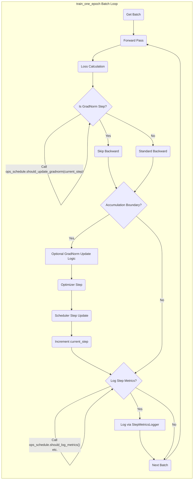

# Developer Guide: Scheduling System

This document details the linnaeus scheduling system, managed primarily by the `OpsSchedule` class (`linnaeus/ops_schedule/ops_schedule.py`), configuration parameters, and supporting utilities.

## 1. Overview

The scheduling system coordinates various time-dependent training operations:

-   **Learning Rate:** Managed by schedulers in `linnaeus/lr_schedulers/`, configured via `LR_SCHEDULER.*`.
-   **Validation Runs:** Standard, mask-meta, and partial mask-meta validation, configured via `SCHEDULE.VALIDATION.*`.
-   **Checkpointing:** Saving model state, configured via `SCHEDULE.CHECKPOINT.*`.
-   **Early Stopping:** Terminating training based on metrics, configured via `TRAIN.EARLY_STOP.*`.
-   **Meta-Masking Probability:** Adjusting the chance of masking metadata, configured via `SCHEDULE.META_MASKING.*`.
-   **Mixup Application:** Controlling mixup probability and grouping level, configured via `SCHEDULE.MIXUP.*`.
-   **Metrics Logging:** Controlling frequency of logging different metrics, configured via `SCHEDULE.METRICS.*`.

## 2. Core Component: `OpsSchedule`

The `OpsSchedule` class is the central decision-maker for *when* scheduled events should occur.

-   **Initialization:** Takes the fully resolved `config` and the `MetricsTracker` (for early stopping metric checks). It also holds a reference to the `TrainingProgress` instance (set via `set_training_progress`) to query the current state (epoch, global step).
-   **Decision Methods:** Provides methods like `should_validate()`, `should_save_checkpoint()`, `should_stop_early()`, `should_update_gradnorm()`, etc. These methods typically check the current progress (epoch or step) against configured intervals or thresholds.
-   **Value Methods:** Provides methods like `get_meta_mask_prob()`, `get_null_mask_prob()`, `get_mixup_prob()`, `get_mixup_group_level()`. These methods calculate the scheduled value based on the *current step*.
-   **Step Dependency:** **Crucially**, methods that depend on the current progress within an epoch (like `should_update_gradnorm`, `get_*_prob`) now **require the `current_step` (optimizer step count) to be passed as an argument**. They no longer rely solely on the `TrainingProgress.global_step` which is only updated at epoch end.
-   **Supported Scheduler Types:** The system now supports four different learning rate scheduler patterns: 'cosine', 'linear', 'step', and 'wsd' (Warmup-Stable-Decay).

## 3. Configuration (`SCHEDULE.*`, `LR_SCHEDULER.*`, `TRAIN.EARLY_STOP.*`)

Scheduling is primarily configured within the `SCHEDULE` section of the YAML config, supplemented by `LR_SCHEDULER` and `TRAIN.EARLY_STOP`.

### Parameter Definition Methods

As outlined in the [Style Guide](./style_guides/schedule_parameters.md) (to be replaced by this doc section):

-   Use **absolute steps** (`*_STEPS`), **fraction of total steps** (`*_FRACTION`), or **epochs** (`*_EPOCHS`).
-   **Choose only ONE method** per parameter. Set unused step/epoch parameters to `0` or `None` for fractions.
-   Fraction-based parameters are generally preferred for portability across different dataset sizes/training durations.

### Resolution

-   At startup (`main.py`), `utils.schedule_utils.resolve_all_schedule_params` converts all `*_FRACTION` settings into absolute `*_STEPS` based on the calculated `total_steps`.
-   `OpsSchedule` then uses these resolved step counts for its decisions.
-   Epoch-based intervals (`*_EPOCHS`) are used directly by checking `TrainingProgress.current_epoch`.

### Validation & Sanity Checks

-   `utils.schedule_utils.validate_schedule_config`: Checks for *conflicting* definitions (e.g., both `INTERVAL_STEPS` and `INTERVAL_EPOCHS` set > 0). Raises errors.
-   `utils.schedule_utils.validate_schedule_sanity`: Checks for *potentially problematic* configurations (e.g., no validation interval defined). Logs warnings.
-   **Schedule Summary:** A detailed summary and text visualization are logged and saved to `assets/schedule_summary.txt`, showing the resolved step counts and timings for all major scheduled events. **Reviewing this summary is essential before long runs.**

## 4. Integration with Training Loop

### Learning Rate

-   Built by `lr_schedulers.build.build_scheduler` using resolved `total_steps` and `warmup_steps`.
-   Stepped *after* each optimizer update in `train_one_epoch` using `lr_scheduler.step_update(current_step)`.
-   Scaling applied once at initialization based on effective batch size.
-   Supports multiple scheduler types: 'cosine', 'linear', 'step', and 'wsd' (Warmup-Stable-Decay).

### Validation & Checkpointing

-   Checks (`should_validate`, `should_save_checkpoint`) are performed at the **end** of each epoch loop in `main.py`.
-   These methods use `TrainingProgress.current_epoch` and `TrainingProgress.global_step` along with configured intervals (`INTERVAL_EPOCHS`, resolved `INTERVAL_STEPS`).
-   Validation runs (`validate_one_pass`, `validate_with_partial_mask`) and checkpoint saving (`save_checkpoint`) are triggered based on these checks.

### GradNorm Updates

-   The check `ops_schedule.should_update_gradnorm(current_step)` is performed *inside* the `train_one_epoch` loop *before* the potential optimizer step.
-   It receives the **local `current_step`** variable, ensuring the check uses the up-to-date optimizer step count.
-   If it returns `True`, the GradNorm update logic (`grad_weighting.update_gradnorm_weights_reforward`) is executed *before* the optimizer step for that batch.

### Meta-Masking / Null Masking / Mixup Probabilities

-   Probabilities (`get_meta_mask_prob`, `get_null_mask_prob`, `get_mixup_prob`) are calculated based on the **current step**.
-   `get_null_mask_prob(current_step)` is called within `loss.masking.apply_loss_masking`, receiving the correct step.
-   `get_meta_mask_prob(current_step)` and `get_mixup_prob(current_step)` are primarily used by `StepMetricsLogger.log_schedule_values` for logging, receiving the correct step. If these probabilities were used directly to *apply* masking/mixup per step (they currently aren't applied dynamically per step in the dataloader collate), those call sites would also need the `current_step`.

### Mixup Group Level

-   `get_mixup_group_level(current_step)` determines the group key.
-   This is called once at the *start* of each epoch in `main.py` to configure the `GroupedBatchSampler`. It uses the `TrainingProgress.global_step` at the *start* of the epoch, which is sufficient as the level is fixed for the entire epoch. **Note: Scheduled switching is disabled.**

## 5. Mermaid Diagrams

### `train_one_epoch` Inner Loop Decisions



### End-of-Epoch Decisions (`main.py`)

```mermaid
graph TD
    subgraph End of Epoch in main.py
        direction TB
        E1(train_one_epoch returns) --> E2(Finalize Train Metrics);
        E2 --> E3(Update TrainingProgress.global_step);
        E3 --> E4{Save Checkpoint?};
        E4 -- Call ops_schedule.should_save_checkpoint() --> E4;
        E4 -- Yes --> E5[Save Checkpoint];
        E4 -- No --> E6{Run Validation?};
        E5 --> E6;
        E6 -- Call ops_schedule.should_validate() etc. --> E6;
        E6 -- Yes --> E7[Run Validation(s)];
        E6 -- No --> E8{Early Stop?};
        E7 -- Validation Done --> E8;
        E8 -- Call ops_schedule.should_stop_early() --> E8;
        E8 -- Yes --> E9(Break Epoch Loop);
        E8 -- No --> E10(Log Epoch Results);
        E10 --> E11(Next Epoch);
    end

```

## 6. Conclusion

The scheduling system provides a robust framework for managing training dynamics. Key takeaways for developers:

-   Configure schedules primarily via `SCHEDULE.*`, `LR_SCHEDULER.*`, and `TRAIN.EARLY_STOP.*`.
-   Prefer fraction-based parameters where applicable.
-   Understand that `OpsSchedule` uses the correct `current_step` for intra-epoch decisions and `TrainingProgress.global_step` / `current_epoch` for epoch-boundary decisions.
-   Always review the generated schedule summary and visualization.
-   Use the centralized `TrainingProgress` API for all progress tracking needs.
