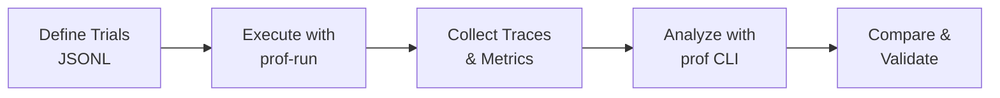

# Linnaeus Profiling System

The Linnaeus profiling system provides comprehensive tools for performance analysis, optimization validation, and automated benchmarking of training runs.

## Quick Start

```bash
# Install with profiling dependencies
pip install -e ".[profiling]"

# Run automated profiling trials
linnaeus-prof-run --trial-params-file trials.jsonl --output-dir results --timeout 600

# Analyze profiler traces
linnaeus-prof summary /path/to/experiment/run --output-format md

# Compare baseline vs optimized
linnaeus-prof diff baseline_run/ optimized_run/ --output-format md --save comparison.md
```

## Components

### 1. [linnaeus-prof-run](./prof-run.md) - Automated Trial Execution
Orchestrates multiple training trials with different configurations, git branches, and environments in isolated Docker containers.

### 2. [linnaeus-prof](./prof-cli.md) - Performance Analysis CLI
Analyzes PyTorch profiler traces, compares runs, and generates reports for identifying bottlenecks and validating optimizations.

### 3. [Profiling Validate Contract](./prof-validate.md) - Preflight Hardening
Validates config/trial/template contracts and git provenance before relaunch.

### 4. [Multi-Level Profiling](./profiling-levels.md) - Instrumentation System
Configurable profiling depth from high-level timing (Level 1) to per-module breakdowns (Level 3).

## Workflow Overview



## Common Use Cases

### A/B Testing Optimizations
```jsonl
{"name": "baseline", "git_ref": "main", "config_file": "configs/test.yaml"}
{"name": "optimized", "git_ref": "feature/optimization", "config_file": "configs/test.yaml"}
```

### Multi-GPU Concurrent Execution
```bash
linnaeus-prof-run \
  --trial-params-file trials.jsonl \
  --max-concurrent 2 \
  --gpu-assignment auto
```

### Performance Regression Detection
```bash
linnaeus-prof diff production_baseline/ latest_commit/ \
  --output-format json | jq '.summary.avg_speedup < 0.95'
```

## Key Features

- **Reproducible Benchmarking**: Git commit pinning, environment control
- **Concurrent GPU Execution**: 2x speedup on dual-GPU systems
- **Automated Trace Repair**: Fixes H100 DDP corruption patterns
- **Component-Level Analysis**: Detailed breakdown of model stages, data pipeline, losses
- **Multiple Output Formats**: Console, JSON, Markdown, HTML

## Documentation

- [Automated Trial Execution Guide](./prof-run.md)
- [Performance Analysis CLI Reference](./prof-cli.md)
- [Profiling Validate Contract](./prof-validate.md)
- [Multi-Level Profiling Configuration](./profiling-levels.md)
- [Best Practices & Troubleshooting](./best-practices.md)

## Integration with Development Workflow

The profiling system is integral to the Linnaeus model architecture development workflow (Phases 3-5):

**Phase 3: Profile-Guided Development**
- Establish baseline performance metrics
- Identify bottlenecks with Level 2/3 profiling
- Test optimizations with A/B trials

**Phase 4: Scale Testing**
- Validate performance across hardware configurations
- Test distributed training efficiency
- Benchmark memory usage patterns

**Phase 5: Production Validation**
- Final performance certification
- Regression testing against baselines
- Documentation of achieved improvements

For internal workflow details, see `.claude/workflow_reference/model_arch_dev_workflow.md`.
